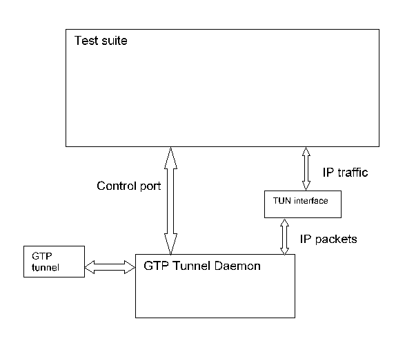

= GTP Tunnel Daemon for TTCN-3 Toolset with TITAN, Function Description
:author: Gábor Szalai
:revnumber: 1551-CNL 113 827, Rev. A
:revdate: 2017-04-12
:toc:

= Introduction

== How to Read this Document

This is the Function Specification for the GTP Tunnel Daemon. GTP Tunnel Daemon is developed for the TTCN-3 Toolset with TITAN. This document should be read together with the <<_3,Product Revision Information>>.

== Scope

The purpose of this document is to specify the content of the GTP Tunnel Daemon. The document is primarily addressed to the end users of the product. Basic knowledge of <<_2,TTCN-3>> and <<_4,TITAN TTCN-3 Test Executor>> is valuable when reading this document.

== References

1. [[_1]]3GPP TS 29.060 +
General Packet Radio Service (GPRS); GPRS Tunnelling Protocol (GTP) across the Gn and Gp interface

2. [[_2]]ETSI ES 201 873-1 v3.2.1 (2007-02) +
The Testing and Test Control Notation version 3; Part 1: Core Language

3. [[_3]]109 21-CNL 113 827-1 Uen +
GTP Tunnel Daemon for TTCN-3 Toolset with TITAN, Product Revision Information

4. [[_4]]1/198 17-CRL 113 200/6 Uen +
User Guide for the TITAN TTCN-3 Test Executor

== Abbreviations

SCTP:: Stream Control Transmission Protocol

TTCN-3:: Testing and Test Control Notation version 3

== Terminology

No specific terminology is used.

== System Requirements

Protocol modules are a set of TTCN-3 source code files that can be used as part of TTCN-3 test suites only. Hence, GTP Tunnel Daemon alone does not put specific requirements on the system used. However, in order to compile and execute a TTCN-3 test suite using the set of protocol modules, the following system requirements must be satisfied:

* TITAN TTCN-3 Test Executor 1.8.pl0.pre2 or higher installed. For installation guide, see <<_2,here>>.
* Linux kernel with tun/tap interface enabled.

= GTP Tunnel Daemon

== Overview

The GTP Tunnel Daemon provides a transparent tunnelling for IP traffic over GTP-U tunnel. The parameters of the GTP tunnel are controlled over the control interface of the GTP Tunnel Daemon.

The TTCN3 test port for the control interface of the GTP Tunnel Daemon is part of the product.

== Installation

The set of protocol modules can be used in developing TTCN-3 test suites using any text editor. However, to make the work more efficient, a TTCN-3-enabled text editor is recommended (e.g. nedit, xemacs). Since the SCTP protocol is used as a part of a TTCN-3 test suite, this requires TTCN-3 Test Executor to be installed before the module can be compiled and executed together with other parts of the test suite. For more details on the installation of TTCN-3 Test Executor, see the relevant section of the <<_4,User Guide for the TITAN TTCN-3 Test Executor>>.

== Configuration

None.

= Functional specification

== Control test port

Provides the control interface of the GTP Tunnel Daemon.

Available operations:

* `GTP_Tunnel_init`: initializes the control connection towards the daemon
* `GTP_Tunnel_create`: creates a GTP tunnel
* `GTP_Tunnel_destroy`: destroys the GTP tunnel
* `GTP_Tunnel_bye`: gracefully closes the control connection

== GTP Tunnel Daemon

Handles the tunnelling of IP packets over GTP-U. When started it creates a TUN interface for the IP traffic. The TUN interface works as an ordinary network interface so any kind of IP traffic can use it.

Because the TUN interface uses the IP stack of the kernel, any functionality provided by the IP stack is available including: IPv4, IPv6, IPSec, ICMP.

The GTP Tunnel Daemon supports multiple GTP tunnels, and multiple TEIDs for one IP address.
